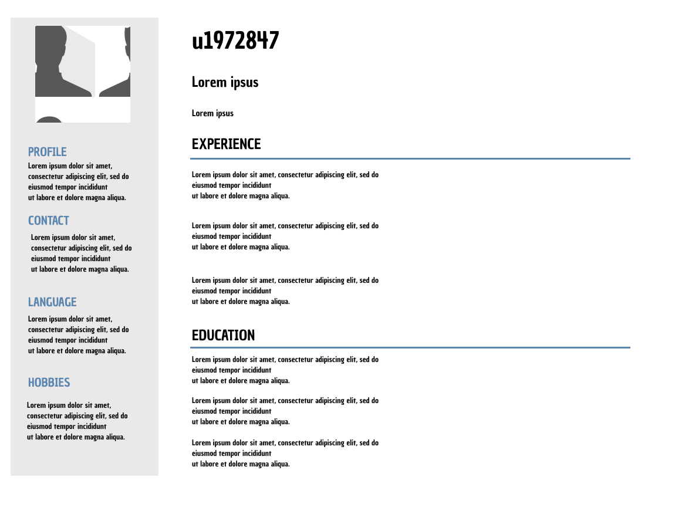

# Hypermedia Part 1

## Project analysis

### Final User

This project is made for users who are looking to hire on a specific IT field (SysAdmin/Software Developer). 
In my project they will find all the basic information needed to know if they are interested in contacting/hiring me.

 

### Information architecture

It's just a single-page project, so there's not much analysis to do.  

### Visual design

- Color Palette:  
   - For the information on the left side I've used grey(#eae8e9) for the background, black for the text and blue for the titles(#5a86af). 
   - For the Right side I've just used black for the text and white for the background.
- Typography: 
  - I wanted to use 'Avenir' but a lot of browsers wouldn't have it installed so I opted to use 'Century' which every browser has and I personally think it's professional enough.
- Page layout: 
  - To get inspired I decided to look at a lot of people's CV. After some time I chose to do a simple Left and Right Layout, I think it's the best way possible to give the information to the reader, it goes straight to the point and there aren't many things to get distracted.

## Figma Proposal
[Link Figma Project](https://www.figma.com/file/FQA77s4NdwsyQsh6YvRB3n/Curriculum)   

## Project implementation
[Public Link](https://u1972847.github.io/p1/)

